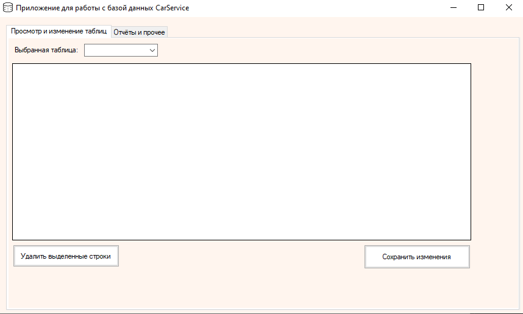
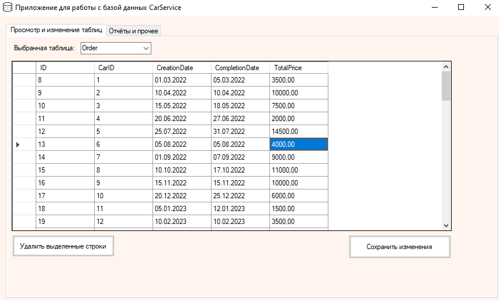
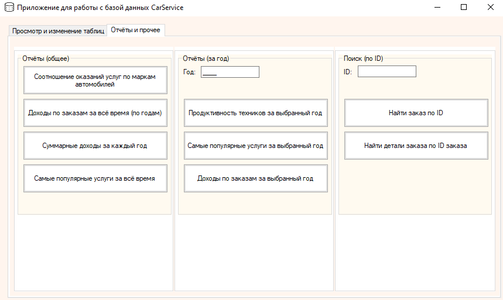

# Приложение для работы с базой данных гипотетического автосервиса  
Приложение, позволяющие гипотетическому автосервису работать со своей базой данных в удобном и простом формате. В приложении есть возможность просмотра/изменения данных существующих таблиц, а также формирования готовы, заранее предопределённых отчётов по существующим данным в виде графиков/таблиц.  

  

# Использованные технологии
Программа была создана с использованием:
* Microsoft Visual Studio Version 17
* C# 7.3
* .NET Framework 4.7.2
* Microsoft SQL Server 16.0.1000.6
# Установка и запуск
1. Скачать и распаковать архив CarService из [релизов](https://github.com/qwert312/university-projcets/releases/latest).
2. Создать и заполнить базу данных из скрипта CarService.sql, выполнив его в MSSQL Server. В самом скрипте предварительно необходимо поменять физические пути файла данных и журнала транзакций на свои собственные в блоке создания базы данных. MSSQL Server перед выполнением скрипта нужно запускать от имени администратора.
3. Поменять в файле конфигурации приложения (CarService.exe.config) строку подключения на ту, которая используется у вас.
4. Запустить CarService.exe

Для работы с исходным кодом достаточно скачать и распаковать архив Source из того же места, а затем открыть папку CarService.
# Использование
В приложении есть две основные вкладки, на которых происходит работа  
  
### Вкладка "Просмотр и изменение таблиц"
На этой вкладке можно выбрать нужную таблицу, чтобы просмотреть её, а также изменить в ней записи. Изменить существующие / добавить новые записи можно прямо в появившейся таблице, удаление же существующих записей происходит с помощью кнопки "Удалить выделенные строки". Сохранение изменений данных происходит с помощью кнопки "Сохранить изменения".  

  
  
### Вкладка "Отчёты и прочее"
На этой вкладке можно сформировать готовые отчёты по имеющимся в БД данным, а также найти заказы или их детали по ID. Отчёты формируются нажатием на соответствующие кнопки. Для отчётов или других форм, где требуются вручную задавать какие-то значения, для этого в их блоке есть соответствующее текстовое поле, где и нужно вводить эти данные, и только уже потом нажимать на кнопки. Все информация при нажатии на кнопки выводится в виде отдельного окна.

